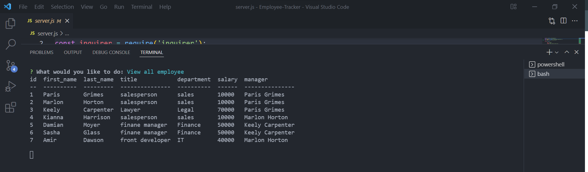

# Employee-Tracker

 ## Images
  
-----

  ## Description
   animal and zoo keepers catalog for the zoo

  
  ## Installation

  - Clone the repo
  - use server.js
  - Open terminal and run "npm init"
  - Run "npm i mysql2",i console.table --save","npm i inquirer",,"npm start"

  
  ## Questions
  Contact for questions and suggestions:

  Menderes

  [email](mailto:mndrs.kc@gmail.com)

  [GitHub](https://github.com/mendereskoc